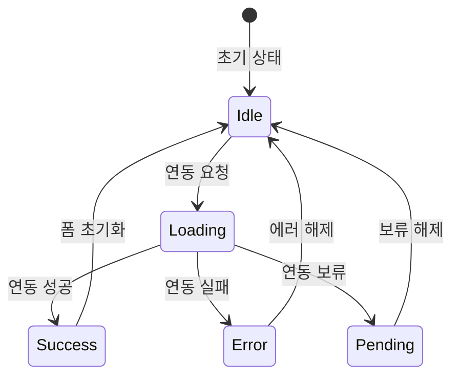

# 계정 연동 상태 관리 문서

## 개요

계정 연동 시 발생하는 다양한 상태와 전이 규칙을 정의합니다.

## 상태 다이어그램



## 상태 정의

### 1. Idle (대기)
- **설명**: 연동 요청 전 기본 상태
- **UI 표시**: 연동 버튼 활성화
- **사용자 액션**: 폼 입력, 연동 버튼 클릭

### 2. Loading (로딩)
- **설명**: 연동 요청 처리 중
- **UI 표시**: 
  - 연동 버튼 비활성화 + 스피너
  - "연동 중..." 텍스트
- **제한사항**: 중복 클릭 방지

### 3. Success (성공)
- **설명**: 연동 성공
- **UI 표시**:
  - 성공 토스트 메시지
  - 계정 리스트에 새 항목 추가
  - 폼 자동 초기화
- **자동 전이**: 3초 후 Idle로 전이

### 4. Error (실패)
- **설명**: 연동 실패
- **UI 표시**:
  - 에러 배너 표시
  - 첫 번째 에러 필드로 포커스 이동
  - 연동 버튼 재활성화
- **사용자 액션**: 에러 배너 닫기, 폼 수정

### 5. Pending (보류)
- **설명**: 연동 보류 (비동기 처리)
- **UI 표시**:
  - 보류 상태 배지
  - 계정 리스트에 보류 상태로 추가
  - 폼 자동 초기화
- **자동 전이**: 3초 후 Idle로 전이

## 상태 전이 규칙

### 연동 요청 시
```
Idle → Loading
조건: 유효한 폼 데이터 + 연동 버튼 클릭
```

### 연동 성공 시
```
Loading → Success
조건: API 응답 성공 + 계정 생성 완료
```

### 연동 실패 시
```
Loading → Error
조건: API 응답 실패 또는 유효성 검사 실패
```

### 연동 보류 시
```
Loading → Pending
조건: API 응답 보류 (비동기 처리 필요)
```

### 상태 초기화
```
Success → Idle
Error → Idle
Pending → Idle
조건: 사용자 액션 또는 자동 타임아웃
```

## 에러 처리 규칙

### 1. 필드 유효성 검사
- **실시간 검사**: 사용자 입력 시 즉시 검증
- **에러 표시**: 필드 하단에 빨간색 메시지
- **접근성**: `aria-invalid` 속성 설정

### 2. API 에러 처리
- **네트워크 에러**: "네트워크 오류가 발생했습니다"
- **인증 에러**: "인증 정보가 올바르지 않습니다"
- **서버 에러**: "서버 오류가 발생했습니다"

### 3. 포커스 관리
- **에러 발생 시**: 첫 번째 에러 필드로 자동 포커스
- **접근성**: 스크린 리더를 위한 `aria-live` 속성

## 접근성 고려사항

### 1. 스크린 리더 지원
```html
<!-- 상태 변경 알림 -->
<div aria-live="polite" role="alert">
  연동이 완료되었습니다.
</div>

<!-- 에러 필드 표시 -->
<input aria-invalid="true" aria-describedby="error-message" />
<div id="error-message">필수 필드입니다.</div>
```

### 2. 키보드 네비게이션
- **Tab 순서**: 논리적인 필드 순서
- **Enter 키**: 폼 제출
- **Escape 키**: 에러 배너 닫기

### 3. 시각적 피드백
- **로딩 상태**: 스피너 + 버튼 비활성화
- **성공 상태**: 초록색 토스트
- **에러 상태**: 빨간색 배너 + 필드 하이라이트

## 테스트 시나리오

### 1. 정상 연동 플로우
1. 유효한 데이터 입력
2. 연동 버튼 클릭
3. 로딩 상태 확인
4. 성공 토스트 확인
5. 계정 리스트 업데이트 확인

### 2. 에러 처리 플로우
1. 잘못된 데이터 입력
2. 연동 버튼 클릭
3. 에러 배너 표시 확인
4. 에러 필드 포커스 확인
5. 에러 배너 닫기 확인

### 3. 보류 상태 플로우
1. 유효한 데이터 입력
2. 연동 버튼 클릭
3. 보류 상태 배지 확인
4. 계정 리스트에 보류 상태 추가 확인

## 구현 파일 구조

```
hooks/
├── useAccountLinking.ts          # 상태 관리 훅

services/
├── accountsLinking.ts            # 연동 서비스 로직

components/
├── ui/
│   ├── status-badge.tsx         # 상태 배지 컴포넌트
│   ├── error-banner.tsx         # 에러 배너 컴포넌트
│   └── success-toast.tsx        # 성공 토스트 컴포넌트
└── accounts/
    ├── AccountForm.tsx          # 연동 폼 컴포넌트
    └── AccountList.tsx          # 계정 목록 컴포넌트
```
